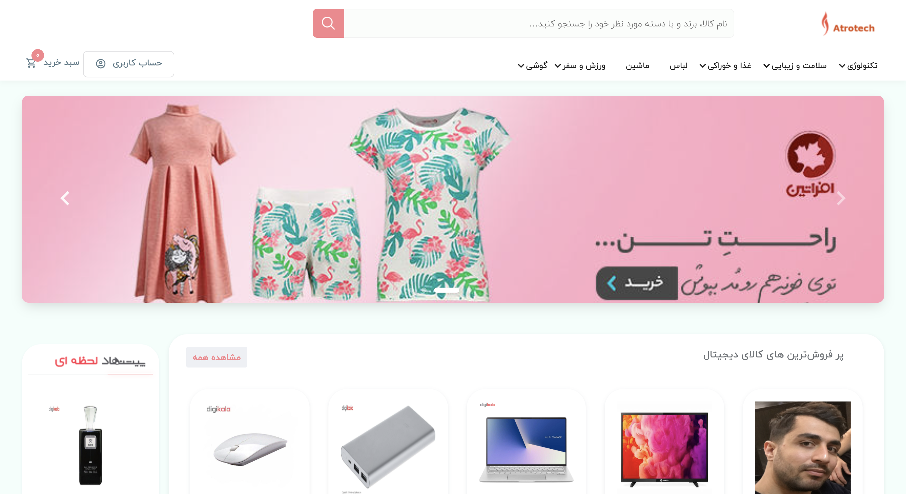
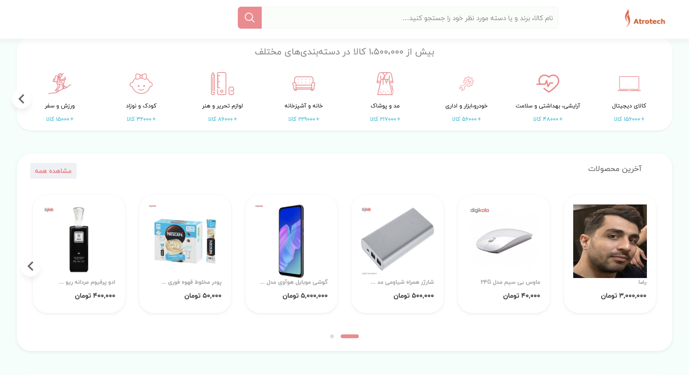
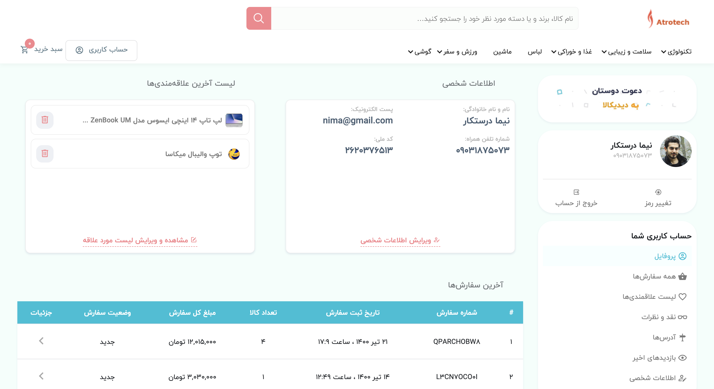
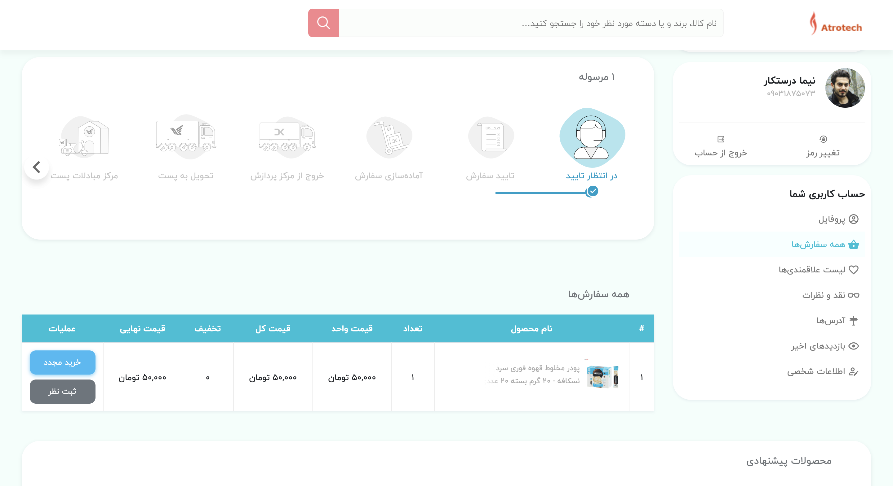
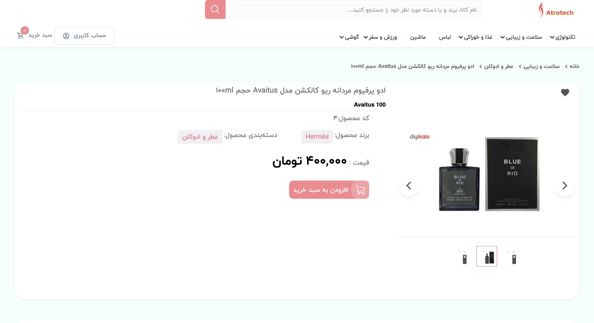

# Didikala

Django Ecommerce | Build Advanced Django Web Application
<br>
Open-source project generated by Atrotech in **Django** Framework. [Atrotech](https://atrotech.ir/)

<hr>

This is a advanced e-commerce website like Digikala built with Django framework.
The website displays products. Users can add and remove products to/from their cart while also specifying the quantity of each item. They can then enter their address and choose Stripe to handle the payment processing.

<br>

### Screenshots

<table>
  <tr>
  <td align="center">
      <a href="https://github.com/nimadorostkar/DjangoCRM/blob/master/screenshots/login.png">
        
      </a>
      <br />
      <p>Login Page</p>
    </td>
    <td align="center">
      <a href="https://github.com/nimadorostkar/DjangoCRM/blob/master/screenshots/dashboard.png">
        
      </a>
      <br />
      <p>Dashboard</p>
    </td>
    <td align="center">
      <a href="https://github.com/nimadorostkar/DjangoCRM/blob/master/screenshots/contacts.png">
        
      </a>
      <br />
      <p>Contacts</p>
    </td>
    <td align="center">
      <a href="https://github.com/nimadorostkar/DjangoCRM/blob/master/screenshots/product.png">
        
      </a>
      <br />
      <p>Products</p>
    </td>
    <td align="center">
      <a href="https://github.com/nimadorostkar/DjangoCRM/blob/master/screenshots/tasks.png">
        
      </a>
      <br />
      <p>Tasks</p>
    </td>
    </tr>
</table>

### Clone this repository

```
git clone https://github.com/nimadorostkar/Didikala.git
```

### Install Dependencies
```
pip install -r requirements.txt

```
### Run the following commands to get started:

```
python manage.py makemigrations
python manage.py migrate --run-syncdb
python manage.py runserver
```
